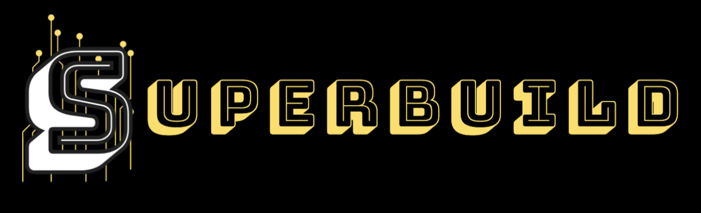

# SuperBuild 🚀

SuperBuild is an intuitive **no-code platform** that empowers users to create **web and mobile applications** effortlessly. With a **drag-and-drop interface**, **automated workflows**, and seamless **third-party integrations**, building applications has never been easier.

## 🌟 Key Features
- **Drag-and-Drop Builder** – Design your app visually without writing code.
- **Custom Workflows** – Automate logic and actions with ease.
- **API & Service Integrations** – Connect to external platforms effortlessly.
- **Responsive Design** – Ensure a seamless experience across all devices.
- **One-Click Deployment** – Instantly publish your app with minimal effort.
- **Collaboration Tools** – Work with your team in real time.

## 🛠 Tech Stack
- **Frontend:** Next.js, Tailwind CSS
- **Backend:** Node.js, Express.js
- **Database:** MongoDB
- **Authentication:** Firebase/Auth0
- **Hosting:** Vercel, Cloudflare Workers

## 🚀 Getting Started
### Prerequisites
Ensure you have the following installed:
- **Node.js** (v16+)
- **npm** or **yarn**

## 📖 How to Use
1. **Sign Up** – Create an account and start a new project.
2. **Design UI** – Use the drag-and-drop builder to structure your app.
3. **Configure Workflows** – Define business logic and automation.
4. **Integrate APIs** – Connect external services and databases.
5. **Deploy with One Click** – Instantly launch your app to production.

## 🤝 Contributing
We welcome contributions! Here’s how you can help:
1. **Fork the repository**
2. **Create a feature branch** (`git checkout -b feature-branch`)
3. **Implement your changes**
4. **Commit and push** (`git commit -m 'Add feature' && git push origin feature-branch`)
5. **Open a Pull Request**

## 📜 License
SuperBuild is released under the **MIT License**.

## 📬 Support
For assistance, reach out via:
- **GitHub Issues** – Report bugs and suggest features.
- **Email:** superbuildcom@gmail.com

---
Start building your dream app today with **SuperBuild**! 🚀

